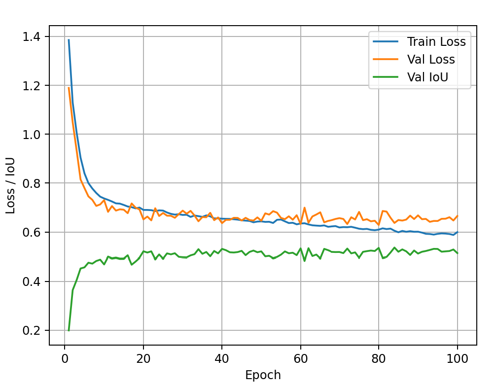

# Лабораторная работа 2 Сегментация дорог

## Датасет
В целом датасет приемлемого качества в val и test частях. Однако в train присутствуют обрезанные изображения, при этом их маски содержат полную картину. Это может вводить нейронную сеть в заблуждение, однако доля таких картинок не велика, поэтому я ограничелся проведением небольшой чисткой датасета вручную.

## Модель
Unet+resnet50. Изначально использовался resnet34 с целью экономии вычислительных ресурсов, однако после первого обучения результаты были плачевны (IoU <0.2), поэтому был сделан выбор в пользу большей resnet50. Также проводились эксперименты с различными loss функциями, в итоге выбор пал на комбинацию jaccard+softBCE. Оптимизатор - AdamW

## Метрики
Изначально рассчитывался только macro IoU и на его основании принимались решения о качестве сегментации + вторично - визуальный анализ результатов. Для последующей тестовой оценки рассчитываются метрики: micro, macro IoU, Dice, Pixel Accuracy, Precision, Recall.

## Результат
Значнеие метрик на тесте:
Micro IoU: 0.5721
Macro IoU: 0.5672
Dice: 0.7273
Pixel Accuracy: 0.9729
Precision: 0.7024
Recall: 0.7542

Кривые обучения:
